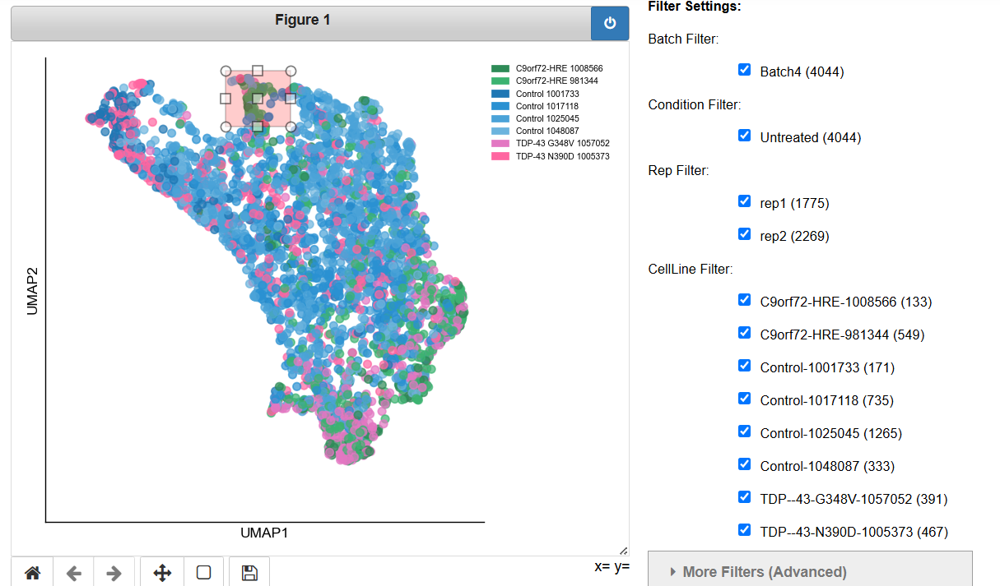

# Interactive UMAP Viewer

## Introduction
This interface enables interactive exploration of 2D UMAP projections of microscopy image data. 
 Users can load existing UMAP embeddings, filter and visualize them, select data points directly from the plots, and preview corresponding raw images and tile information. Additional metadata, such as Brenner image sharpness scores, can be incorporated for further recoloring of the visualizations. 

## Data and Configuration

This tool **does not create new UMAPs from scratch**. It only loads and explores existing UMAP results that were already generated (after the required code update).  
**Before using this tool, make sure the UMAP embeddings you want to explore have already been created and saved.**

Available data sources are defined in the configuration file:  
`interactive_umap_config.py`

To add a new dataset, edit `interactive_umap_config.py` and add a new dictionary entry.  
Each configuration must start with `config_`, for example, `config_myexperiment`.

**Example:**
```python
config_myexperiment = {
    'paths': {
        'umaps_folder': '/path/to/UMAPs/',
        'csv_path': '/path/to/brenner_scores.csv',  # None if not available
        'images_dir': ['/path/to/image_dir1/', '/path/to/image_dir2/']
    },
    'layouts': None,  # None if unknown
    'name': 'ExampleDataset'
}
```

- **`umaps_folder`**: Folder containing UMAP embedding files.
- **`csv_path`**: Path to a CSV file with Brenner (image sharpness) scores. Put `None` if not available.
- **`images_dir`**: List of directories with raw images.
- **`layouts`**: FOV layouts for additional visualizations. Put `None` if unknown.
- **`name`**: String indicating the dataset or experiment name.

You can also leave `config = {}` and type the data paths directly into the fields in the notebook interface when prompted.

## Launching Jupyter Notebook

To use the Interactive UMAP Viewer, you must first launch a Jupyter Notebook session from your computing environment.

1. **Select the Jupyter Notebook App:**  
   - From your Interactive Apps menu, choose **Jupyter Notebook** (see example below).

    

2. **Recommended settings:**
   - **Extra Jupyter Args:**  
     ```
     --NotebookApp.iopub_data_rate_limit=1000000000 --NotebookApp.iopub_msg_rate_limit=10000 --NotebookApp.rate_limit_window=5
     ```
   - **Memory per job:**  
     At least `16G` is recommended (choose more if needed).
   - **Number of hours:**  
     Specify the number of hours for your session as needed.  

3. **Click “Launch” to start your session.**

Once your notebook environment is ready, proceed with the instructions in the next section to open and use the `interactive_umap_GUI` notebook.

## Getting Started

1. **Open the `interactive_umap_GUI` notebook.**
2. **Run the first cell.**  
   This will display all available data sources as defined in the configuration file.

   

3. **Choose a data source:**  
   Select one of the available configurations, or leave the selection empty if you wish to manually enter paths.

4. **Run the next cell to create the UI.**  
   The interactive user interface will appear, and you can begin exploring your data.

*Note: The notebook includes further instructions and explanations for how to set the parameters when running this cell. Please follow the guidance provided within the notebook as you proceed.*

## Workflow: Using the Interactive UMAP Tool

### Step 1: Selecting Data Paths

Upon launching the interface, users are prompted to review and specify the relevant data paths for the current experiment.  
These fields are pre-populated based on the selected configuration but can be modified at this stage as necessary.

- **UMAPs Dir:**  
  The directory containing the precomputed UMAP embedding .pkl files. This field is mandatory.

- **CSV Brenner Path:**  
  The file path to the CSV containing Brenner (image sharpness) scores. This field is optional and may be left blank if such data is unavailable.

- **Raw Images Dirs:**  
  A comma-separated list of directories containing the raw microscopy images. This field is optional and may be left blank if such data is unavailable.
  **Recommendation:** Specify only the direct subdirectories relevant to the experiment, rather than broader parent folders. Including unrelated directories may increase load times and resource usage.

After confirming the accuracy of these paths, click **Run** to proceed.

   

### Step 2: Selecting UMAP Parameters

When clicking **Run**, the tool will locate all UMAP `.pkl` files within the specified UMAPs directory.  
This process may take up to 30 seconds. Once complete, the number of compatible UMAPs found will be displayed.

You can now configure which UMAP to load and display using the dropdown menus:

- **UMAP Type:**  
  Select one of: `MULTIPLEX_MARKERS`, `MULTIPLE_MARKERS`, or `SINGLE_MARKERS`.  
  *Selecting the UMAP Type will automatically update the Batch options.*

- **Batch:**  
  Choose the batch you want to explore.  
  *Changing Batch or UMAP Type updates the available options in the other dropdown menus.*

- **Additional Parameters:**  
  The fields **Marker**, **Cell Line**, **Coloring**, **Condition**, and **Reps** will show only the options available for your chosen UMAP Type and Batch.  
  Not all combinations exist, but the default options are always valid.

#### Plot Controls
- **Mix Groups:**  
  When enabled (default), this option shuffles and displays all groups together on the plot, instead of plotting each group on top of the others.
  This allows for a clearer, more integrated view of the data points from different groups.
  If disabled, each group will be plotted separately in layers, which may result in some data being obscured.

- **Recolor by Brenner:**  
  If a Brenner CSV file has been provided, enabling this option will color the points on the UMAP plot according to their Brenner (image sharpness) scores.  
  If not enabled, points will be colored by their group as usual.

- **Colors (Brenner) Slider:**  
  Adjust this control to set the number of color bins used to represent Brenner scores (when recolor by Brenner is checked); a higher number creates finer distinctions between values.

- **Downsample Slider:**  
  Adjust this slider to display only a subset of the data points.  
  For example, setting the value to 2 will plot every second point.  
  This is recommended for very large datasets to improve clarity and performance.

Once you have set all desired parameters, click **Create UMAP** to generate the corresponding interactive UMAP plot.

  

### Step 3: The Interactive UMAP

Once all parameters have been set and the **Create UMAP** button is clicked, the tool will search for the corresponding UMAP `.pkl` file.  
You will receive a message indicating whether the file was found and, if so, the exact file path.


If the file is located, the UMAP will be displayed on the left. On the right, you will see a panel with all available filtering options:

- **Standard Filters:**  
  Checkboxes for Batch, Condition, Rep, and Cell Line allow you to quickly include or exclude specific groups. 

- **More Filters (Advanced):**  
  This expandable section offers additional filters, such as combinations of Cell Line + Condition, Panel, and Marker. Hold Ctrl to select or deselect multiple options.


Next to each option, the number of available tiles (data points) is shown.

After selecting your desired filters, click **Apply Filters** to update the UMAP display.  
**Note:** This step does not recalculate the UMAP embedding; it simply removes selected data from the current UMAP for fast visualization and exploration.

#### Interactive UMAP Options

  

- **Hover Mode:**  
  If you enabled the hover option when creating the UI, moving your mouse over any data point will display a tooltip with the image name and its Brenner score (if available).

- **Selecting Points:**  
  You can draw a rectangle on the UMAP plot to select a region of interest.

  

- **Show Selected Points:**  
  After selecting an area, specify the number of images you wish to preview (default is 10) and click **Show Selected Points** to display the corresponding images.

- **Save:**  
  Click **Save** to save the current figures to the `saved_umaps` directory.

These features allow rapid and interactive exploration of your data without recomputation.

### Step 4: Examining Selected Points and FOV Maps

After selecting a region of interest on the UMAP and clicking **Show Selected Points**, the interface will display three sections, each providing different information about the selected points.  
From within the selected area, the tool randomly samples the specified number of points (default: 10) for detailed inspection.

1. **Selected Images:**  
   Displays the raw microscopy images (“sites”) corresponding to each selected point. This allows direct visualization of the original images in your dataset.

   

2. **Corresponding Tiles:**  
   For each site shown above, this section displays the extracted tile images.  
   This includes:
   - The marker tile
   - The nucleus tile
   - An overlay image of both marker and nucleus tiles

   

3. **FOV Map:**  
   If `layouts` was specified in the configuration, this section will display field-of-view (FOV) distribution figures for the selected data:
   - The first row includes three heatmaps:
     - **All Data:** FOV distribution across all available data.
     - **Selected Data:** FOV distribution for the selected subset.
     - **Selection Percentage:** The proportion of selected data relative to all data, for each FOV.
   - The second figure shows a histogram comparing FOV coverage for all data versus the selected points.

**Note:**  
The FOV maps and distributions are calculated based on all points within the selected region, not just the random sample displayed in the images above.

This step provides detailed image-level context for your selection and enables rapid assessment of FOV coverage, quality, and representativeness.


## Special Case: MULTIPLEX_MARKERS UMAP Type

When the **MULTIPLEX_MARKERS** UMAP type is selected, each data point on the plot does not correspond to a single tile or marker. Instead, each point represents a concatenation of all the chosen markers for that experiment.

**Implications for Visualization:**
- For each selected point, a single representative tile is chosen at random from its component markers. As a result, in the filtering panel, the marker and its panel will correspond to the randomly selected tiles (and in some cases, also the replicates, depending on the UMAP definition).
- The "Selected Images" and "Corresponding Tiles" sections will therefore display these randomly sampled representative images and their corresponding tiles from the selected region, rather than a one-to-one correspondence.
- The option to color by Brenner score is not available for MULTIPLEX_MARKERS UMAPs, as there is no single sharpness value for a concatenated data point.

## Technical Information

### Code Structure

- The main class is **`InteractiveUMAPPipeline`**, which manages the entire GUI and data processing workflow.  
  This class is located in:  
  `tools/interactive_umap/interactive_umap.py`

- Utility functions are organized in:  
  - `tools/interactive_umap/interactive_umap_utils.py`
  - `tools/show_images_utils.py`

- Plot formatting helpers are found in:  
  - `src/figures/umap_plotting.py`

- Experiment and data source configurations are defined in:  
  - `interactive_umap_config.py`